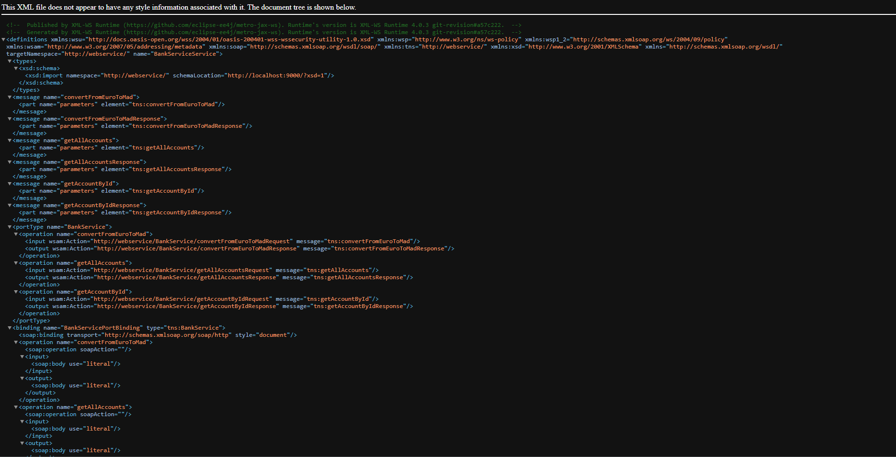
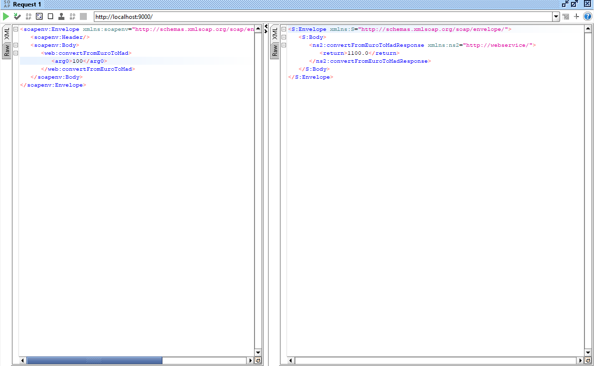
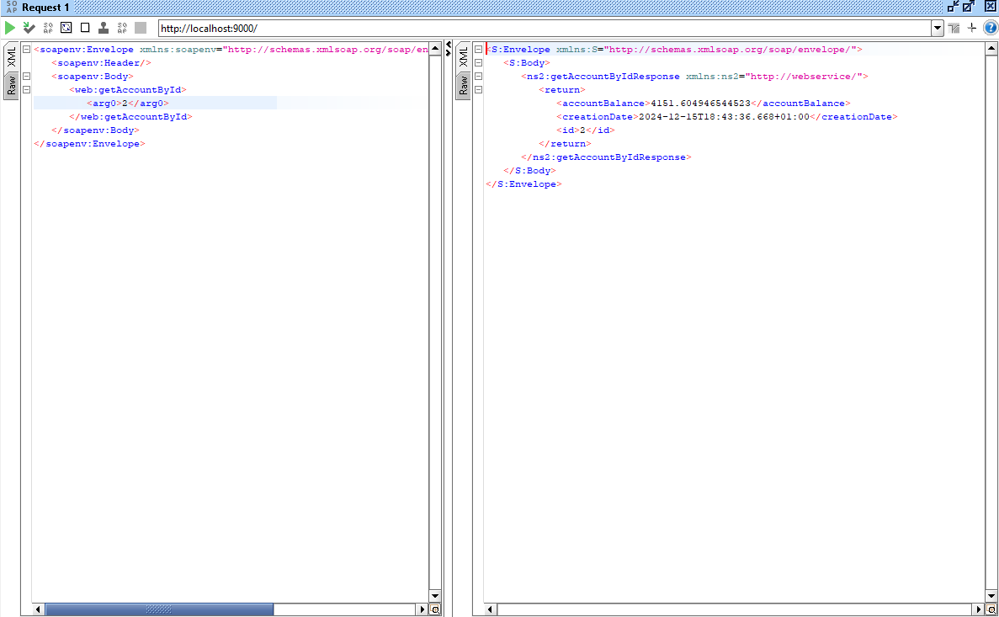
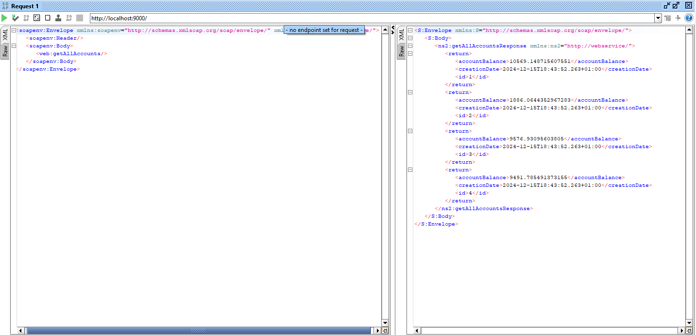
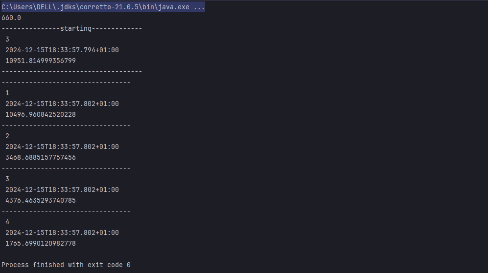

# SOAP Web Service - WSDL Integration Testing
This repository provides an implementation of a SOAP-based web service for banking operations.

## Bank Service WSDL: SOAP Operations for Currency Conversion and Account Management

Below are tests and results for the key endpoints:

## 1. Convert From Euro to MAD
This endpoint converts a specified amount in Euros to MAD

## 2. Get Account By ID
This endpoint fetches account details for a given account ID.

## 3. Get All Accounts
This endpoint retrieves all available accounts with details such as ID, balance, and creation date.

## 4.Test Output from Console

